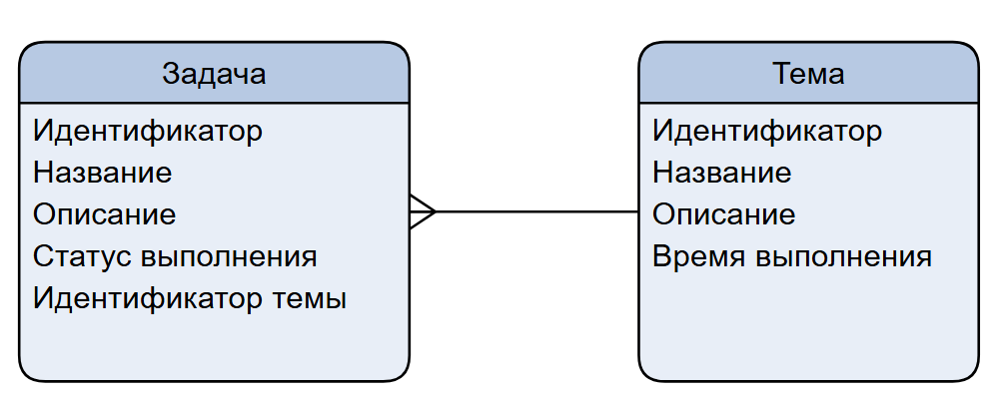
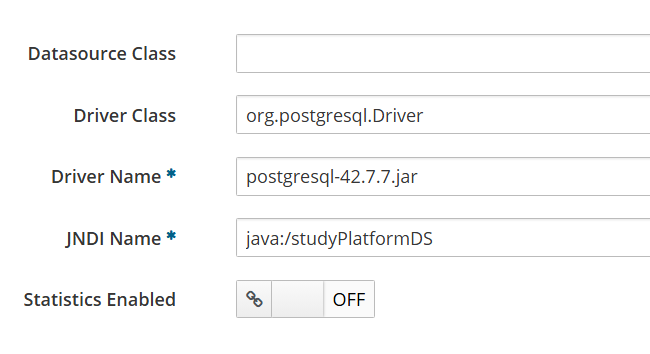
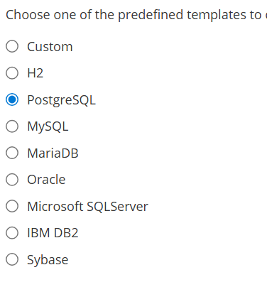
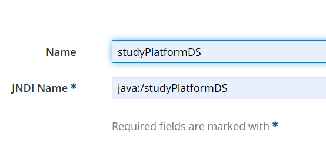
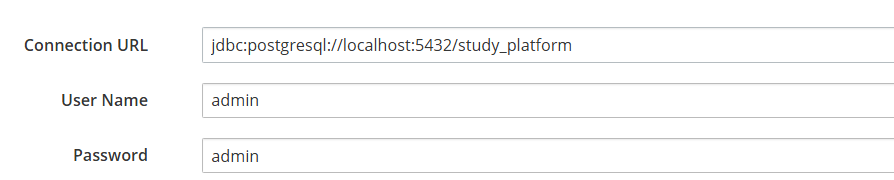

# Лабороторная работа №1
Выполнили: Жукова Анна, Недугов Владимр 6131-010402D
# Предметная область

# Используемые технологии
- Jakarta Servlet 5.0
- Jakarta Pages (JSP) 
- Jakarta Persistence
- Jakarta Contexts and Dependency Injection
- Jakarta Enterprise Beans
- JPA/Hibernate
- PostgreSQL
- Bootstrap
- WildFly
# Настройка
Сервер: WildFly 
Что нужно чтобы запустить сервер
1) Скачать postgresql.jar в директорию standalone\deployments
2) Перейти в директорию "wildfly-37.0.1.Final\bin\" выполнить скрипт 
`./add-user.sh -m -u admin -p admin`
3) Выполнить скрипт 
`./standalone.sh`
4) Перейти в консоль администратора `http://localhost:9990/console/`
5) Создать dataSource 

5.1 

5.2 

5.3 

5.4 

Выполнить деплой war файла приложения

